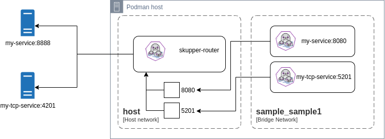

## Introduction

In order to evaluate some strategies for dealing with service ingresses,
when running the skupper-router with Podman or Docker, I have used the simple
scenario below as the foundation for this study:



The router component is connect to the host network, which avoids restarts
when extra ports need to be bound.

In this topology we have two workloads.

* _my-service_ - nginx server
* _my-tcp-service_ - iperf3 server

They are exposed through the _skupper-router_ container, which is binding
ports _8080_ (for nginx) and _5201_ (for iperf3) on the host machine.

Other two containers named respectively _my-service_ and _my-tcp-service_ (for
illustration only) are also created and they are connected to the sample_sample1 (bridge) network,
in order to provide stable name resolution to other containers connected to that
same network. But in theory they could be connected to multiple bridge networks.

These extra containers are also listening to the same ports (8080 and 5201) and
their names can be resolved as _my-service_ and _my-tcp-service_ respectively.

To enable traffic to flow through these containers that are providing name resolution inside
the container network, I have explored four initial scenarios, described in more detail below.

## Scenarios

1. Netfilter / iptables
2. Edge-router
3. HA proxy
4. Envoy proxy

### 1. Netfilter

Using Netfilter (iptables), we can simply add rules to redirect incoming packets reaching the
proxy containers (i.e: _my-service:8080_ and _my-tcp-service:5201_), to the respective
host ports that are bound by the _skupper-router_.

This is a simple solution as it just relies on an ubi9 image with iptables installed. It also seems
to be the fastest choice with minimal resource utilization, compared to the other approaches.

### 2. Edge-router

An edge-router can also be used, as we just need to expose a tcpListener on each container
with the respective router address that will reach the target workloads.

This approach has an extra benefit (to be evaluated) as you don't need to expose the service to the
container's host network (no listener needed on the _skupper-router_), because it does not need a target
IP and Port.

### 3. HAProxy

The HAProxy can be configured as a reverse proxy, forwarding packets to the router
ingress IP and Port. HAProxy is also used by Openshift to provide Route ingress.

### 4. Envoy Proxy

Envoy proxy can be configured similarly to HAProxy. It is a safe, popular and reliable
alternative to be evaluated as well.

## Artifacts for evaluation

You can download and evaluate each of the approaches through the following links.
These samples can be run using `docker compose` or `podman-compose`.

[1. Netfilter](resources/netfilter.tar.gz)

[2. Edge-Router](resources/edgerouter.tar.gz)

[3. HAProxy](resources/haproxy.tar.gz)

[4. Envoy](resources/envoy.tar.gz)

## Validating each scenario

| Container engine | Deploy               | Teardown            | Environemnt      |
| ---------------- | -------------------- | ------------------- | ---------------- |
| Podman           | podman-compose up -d | podman-compose down | CONTAINER=podman |
| Docker           | docker compose up -d | docker compose down | CONTAINER=docker |

For each scenario, you can validate that you're able to access the target services through
Host's port 8080 (HTTP) and 5201 (TCP) as well as through the container's bridge network (_sample_sample1_),
through _my-service:8080_ and _my-tcp-service:5201_.

### HTTP

1. Access through the host:

`CLIENT -> ROUTER -> WORKLOAD`

```bash
curl http://0.0.0.0:8080
```

2. Access through the container's bridge network


`CLIENT -> PROXY -> ROUTER -> WORKLOAD`

_Note:_ The proxy can be one of: netfilter, edge-router, haproxy or envoy.

First adjust the value of the CONTAINER variable to the container engine being used (podman or docker).

```bash
CONTAINER=podman
${CONTAINER} run --rm --network sample_sample1 curlimages/curl http://my-service:8080
```

If you want to run a basic HTTP performance test (runs for 10s with 1 client and 10 connections),
you could also use:

```bash
CONTAINER=podman
${CONTAINER} run --rm --network sample_sample1 quay.io/skupper/wrk wrk -d 10s -c 10 -t 1 --latency http://my-service:8080
```

### TCP

1. Access through the host:

`CLIENT -> ROUTER -> WORKLOAD`

```bash
iperf3 -c 0.0.0.0
```

2. Access through the container's bridge network (with name resolution):

`CLIENT -> PROXY -> ROUTER -> WORKLOAD`

_Note:_ The proxy can be one of: netfilter, edge-router, haproxy or envoy.

First adjust the value of the CONTAINER variable to the container engine being used (podman or docker).

```bash
CONTAINER=podman
${CONTAINER} run --rm --network sample_sample1 quay.io/skupper/iperf3 -c my-tcp-service
```

## Conclusion

If requiring a host's IP/Port to be exposed is not a problem, the Netfilter approach
seems like the best fit.

But in case exposing only into the container's network without exposing it through the host
is a requirement, then Edge-router is the only choice that can be used.

As an upcoming activity, it would be really interesting to do a performance analysis, comparing all the
approaches mentioned here using both TCP (iperf3) and HTTP traffic.
