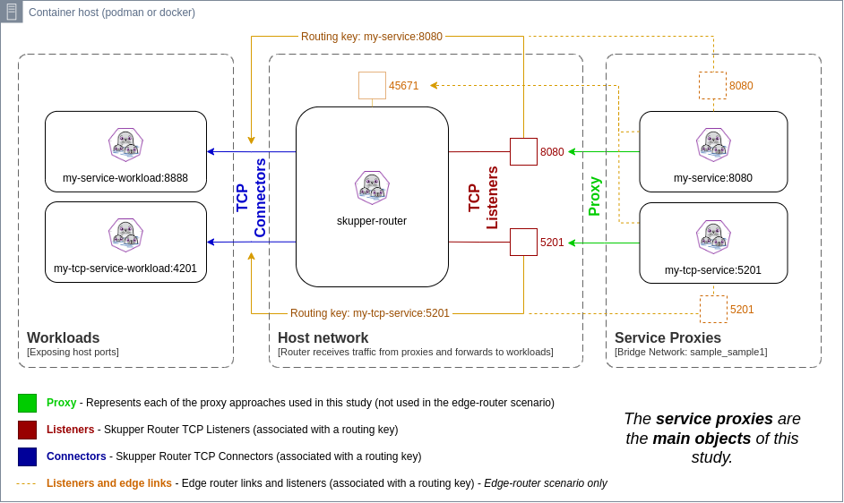

## Introduction

In order to evaluate some strategies for dealing with service ingresses,
when running the skupper-router with Podman or Docker, I have used this simple
scenario below:



The router component is connect to the host network, which avoids restarts
when extra ports need to be bound.

In this topology, the _my-service_ workload is reachable from the container's
host machine.

It is exposed through the _skupper-router_ container, which is binding
port _8080_ on the host machine.

Another container named _my-service_ (for illustration only) is also created
and it can be connected to multiple other container (bridge) networks, in order
to provide a stable name resolution to other containers connected to those container networks.

This extra container is also listening to port 8080 (in all its interfaces) and
it has the _my-service_ alias on all container networks it is connected with.

To enable name resolution inside the container network, I have explored three initial
scenarios that allow traffic reaching the _my-service_ container on port _8080_ to
actually reach the exposed workload through the _skupper-router_, which is actually
listening port 8888.

## Scenarios

1. Netfilter rules to redirect packets to the appropriate target
2. An edge-router that exposes tcpListeners to the appropriate addresses
3. HA proxy as a reverse-proxy

### 1. Netfilter

Using Netfilter, we can simply add rules to redirect incoming packets reaching the
service port (8080) to the _skupper_router_ ingress IP and Port, forcing the traffic to
go through the router, which is important for observability.

This is extremely simple and the fastest choice.

### 2. Edge-router

An edge-router can also be used, as we just need to expose a tcpListener bound to the
service port (8080) and it will use the connector address to ensure data reaches the
target workload.

This approach has an extra benefit as you don't need to expose the service to the
container's host network, because it does not need a target IP and Port. On the other
hand we introduce an extra hop.

### 3. HAProxy

The HAProxy can be configured as a reverse proxy, forwarding packets to the router
ingress IP and Port. In the end it is similar to the Netfilter approach, but it requires
an extra hop processing the packets as well, so this is possibly the least recommended
choice.

## Artifacts for evaluation

You can download and evaluate each of the approaches through the following links.
These samples can be run using `docker compose` or `podman-compose`.

[1. Netfilter](resources/netfilter.tar.gz)

[2. Edge-Router](resources/edgerouter.tar.gz)

[3. HAProxy](resources/haproxy.tar.gz)

## Validating each scenario

| Container engine | Deploy | Teardown |
| ---------------- | ------ | -------- |
| Podman           | podman-compose up -d | podman-compose down |
| Docker           | docker compose up -d | docker compose down |

For each scenario, you can validate that you're able to access the target service through
Host's port 8080 as well as through the container's bridge network (_sample_sample1_) via my-service:8080.

Here is how:

1. Access through the host

```bash
curl http://0.0.0.0:8080
```

2. Access through the container's bridge network

First adjust the value of the CONTAINER variable to the container engine being used (podman or docker).

```bash
CONTAINER=podman
${CONTAINER} run --rm --network sample_sample1 curlimages/curl http://my-service:8080
```

## Conclusion

If requiring a host's IP/Port to be exposed is not a problem, the Netfilter approach
seems like the best fit.

But in case exposing only into the container's network without exposing it through the host
is a requirement, then Edge-router is the only choice that can be used.
