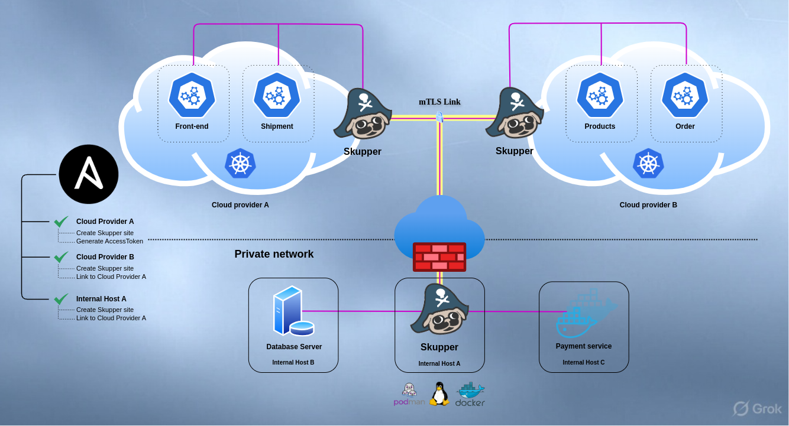
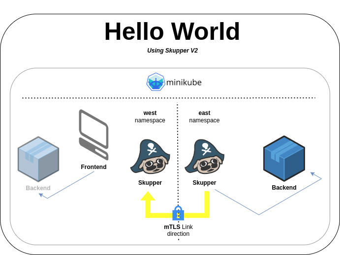

[skupper2]: https://skupper.io/v2/
[skupperv2]: https://galaxy.ansible.com/ui/repo/published/skupper/v2/
[minikube]: https://skupper.io/start/minikube.html
[helloworldv2]: https://github.com/skupperproject/skupper-example-yaml/tree/v2/

## Introduction

[Skupper version 2.0.0][skupper2] has landed and it's bringing a shiny new Ansible collection with it,
now available on Ansible Galaxy as [skupper.v2][skupperv2].



This isn't just another update, it's a toolkit that empowers you to define and manage Skupper networks with ease,
no matter where they run — Kubernetes, Podman, Docker, or bare-metal Linux.

## Declarative power at your fingertips

[Skupper 2.0.0][skupper2] redefines how Virtual Application Networks (VANs) come to life.
At its core is a sleek, declarative approach powered by a fresh set of Kubernetes Custom Resource Definitions (CRDs). Think of it as a blueprint for your network: you describe what you want, and Skupper makes it happen.

These CRDs aren't just for Kubernetes users. They work just as seamlessly outside the Kubernetes ecosystem, delivering a unified, platform-agnostic way to declare and deploy your Skupper network.

### Linking Sites

To build a `VAN` across multiple Skupper sites, you have to generate an `AccessToken` from one site —ideally a public or accessible hub—and share it with another. That token is the golden key that locks the sites into the same network, forging a secure, reliable mTLS Skupper Link to the hub.

Although this process is quite simple and easy to perform manually, when your environment scales, you will need some sort of automation to help you keeping your `VAN` linked and updated.

## New Ansible collection

The [**skupper.v2** Ansible collection][skupper2] introduces the final components needed to define your entire Virtual Application Network (VAN) in a scalable and streamlined way, saving significant time and ensuring reliable, consistent VAN configurations across all your sites.

## Hands-on

In order to demonstrate its power, we are going to create a Virtual Application Network that connects a simple Frontend
application which runs on a local Minikube cluster with a Backend microservice running on another namespace within the
same Minikube cluster.

> **NOTE**
>
> This is just a minimal scenario, for an easy and local evaluation, that is why we are running the two applications within the same cluster. It is based on the [Hello World Example][helloworldv2].




### Pre-requisites

* [A minikube cluster][minikube]
* Minikube tunnel running
* Ansible (>= 2.15.0)
* Install the [skupper.v2][skupperv2] Ansible collection and its dependent python modules
  ```bash
  ansible-galaxy collection install skupper.v2
  python -m pip install kubernetes PyYAML
  ```

### How it works

The goal here is to demonstrate how to setup a Skupper network using Ansible, to connect
kubernetes applications that are initially unable to reach each other.

Here's the `playbook.yaml` content that we will use for that:

```yaml
---
- name: Skupper V2 Hello World Example using Ansible
  hosts: all
  connection: local
  tasks:
    - name: Create Kubernetes namespaces west and east
      kubernetes.core.k8s:
        name: "{{ item }}"
        api_version: v1
        kind: Namespace
        state: present
      loop:
        - west
        - east

    - name: Install cluster scoped Skupper 2.0.0 into Kubernetes
      kubernetes.core.k8s:
        state: present
        definition: "{{ lookup('url', 'https://github.com/skupperproject/skupper/releases/download/2.0.0/skupper-cluster-scope.yaml', split_lines=False) }}"

    - name: Create resources on west namespace
      skupper.v2.resource:
        path: "{{ item }}"
        namespace: west
      loop:
        - https://raw.githubusercontent.com/skupperproject/skupper-example-yaml/refs/heads/v2/west/site.yaml
        - https://raw.githubusercontent.com/skupperproject/skupper-example-yaml/refs/heads/v2/west/listener.yaml
        - https://raw.githubusercontent.com/skupperproject/skupper-example-yaml/refs/heads/v2/west/frontend.yaml
    - name: Create resources on east namespace
      skupper.v2.resource:
        path: "{{ item }}"
        namespace: east
      loop:
        - https://raw.githubusercontent.com/skupperproject/skupper-example-yaml/refs/heads/v2/east/site.yaml
        - https://raw.githubusercontent.com/skupperproject/skupper-example-yaml/refs/heads/v2/east/connector.yaml
        - https://raw.githubusercontent.com/skupperproject/skupper-example-yaml/refs/heads/v2/east/backend.yaml

    - name: Generate an AccessToken to the west namespace
      skupper.v2.token:
        name: west-grant
        namespace: west
      register: result
    
    - name: Create AccessToken on east namespace
      skupper.v2.resource:
        def: "{{ result.token }}"
        namespace: east
```

> **NOTE**
>
> This playbook relies on the `KUBECONFIG` environment variable to be properly set.

Here is a breakdown of the tasks performed by the `playbook.yaml`:

1. Create `west` and `east` namespaces
2. Install skupper 2.0.0 into the `skupper` namespace
3. Create the `west` namespace resources
4. Create the `east` namespace resources
5. Generate an `AccessToken` to the `west` namespace
6. Create `AccessToken` on `east` namespace

> **IMPORTANT**
> The steps **5** and **6** solve the [scalability issue for linking sites](#linking-sites) in your Skupper Network.

## Running the example

1. Open a terminal, set the KUBECONFIG environment variable to make sure you're using the
appropriate Kubernetes cluster.

> **WARNING**
>
> This example creates and modifies three namespaces on your Kubernetes cluster:
>
> * `skupper`,
> * `west` and
> * `east`
>
> In case any of these namespaces exist in your cluster, **do not proceed**, unless you know what you're doing.
>
>  ```bash
>  kubectl get namespace | grep -E '(skupper|west|east)'
>  ```

2. Next download the [`playbook.yaml`](resources/playbook.yaml) to an appropriate location in your file system.

3. Run the Ansible playbook

   ```bash
   ansible-playbook -i localhost, playbook.yaml
   ```

4. Verify that the Front-end application is working

   ```bash
   kubectl -n west port-forward deployment/frontend 8080
   ```

5. Open your browser and go to `http://localhost:8080`

6. Test the application

If you want to clean things up, you can delete the: `west`, `east` and `skupper` namespaces.

```
kubectl delete namespace west east skupper
```

## Summary

[Skupper][skupper2] simplifies the connection of your applications using secure mTLS links between Skupper sites, eliminating the need for elevated privileges or network modifications.

This new version standardizes the Virtual Application Network (VAN) definition, enabling you to declare your VAN in advance, precisely specifying what is exposed internally within the VAN and where each workload will be consumed.

The [**skupper.v2** Ansible collection][skupperv2] streamlines the definition of Skupper resources, regardless of the target platform for your Skupper site, offering a highly convenient mechanism to link sites—regardless of VAN size—while reducing significant effort and maintaining consistency across your VAN.
