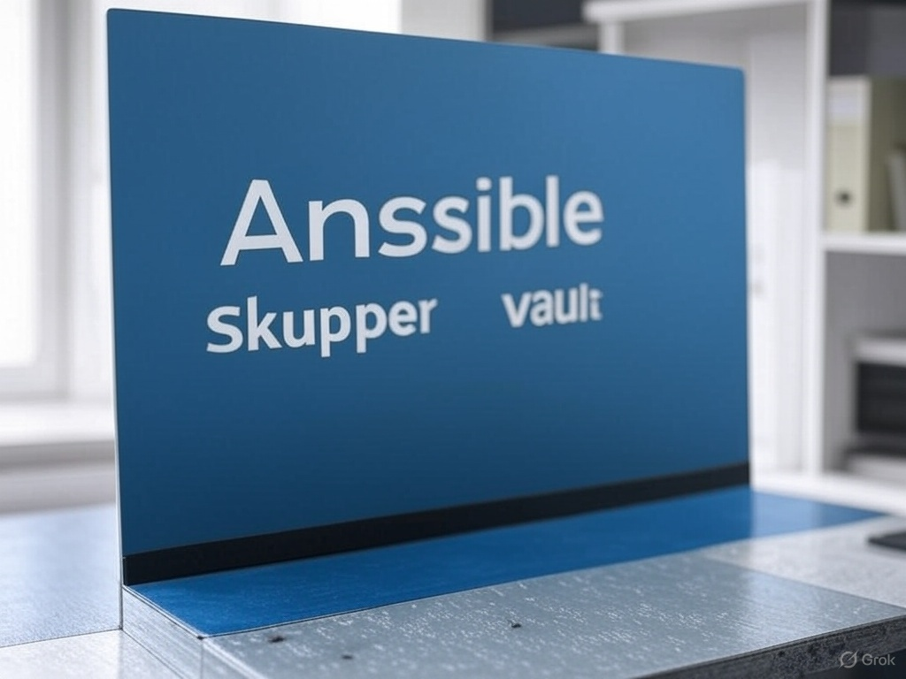
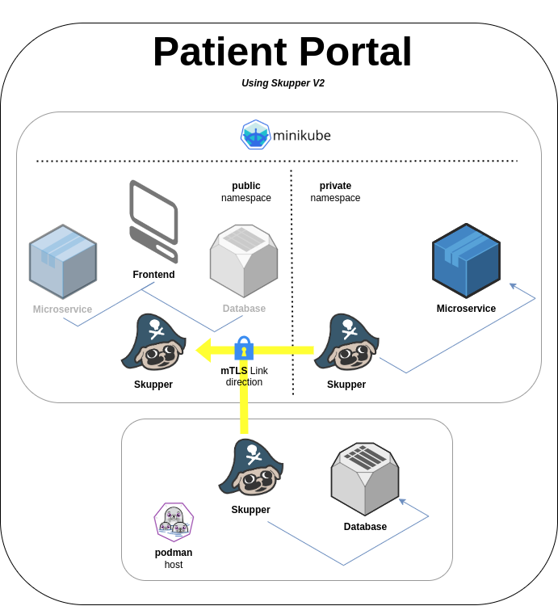

[skupperv2]: https://galaxy.ansible.com/ui/repo/published/skupper/v2/
[minikube]: https://skupper.io/start/minikube.html
[vault]: https://www.vaultproject.io/
[patientportal]: https://github.com/skupperproject/skupper-example-patient-portal



## Introduction

When setting up a Skupper network, a single persona doesn’t always have access to all the participant clusters, namespaces, or non-Kubernetes hosts involved.

This can create a significant hurdle for automation, as Access Tokens or Links generated at one site can’t be automatically shared with a target site.

To address this, the best approach is to assign separate personas to handle the setup of each site within the Skupper network.

This is where HashiCorp Vault comes in handy. Vault enables us to decentralize the token generation and installation processes, allowing them to happen independently and at different times.

In this post, we’ll walk through an automated solution using Ansible. This method empowers different personas—each responsible for a single Skupper site—to build a Skupper network by leveraging HashiCorp Vault as a secure hub for creating and accessing Access Tokens.

## Pre-requisites

* [Hashicorp Vault][vault]
* [A minikube cluster][minikube]
* Minikube tunnel running
* Skupper (>= 2.0.0)
* Ansible (>= 2.15.0)
* Podman (or Docker)
* Install the [skupper.v2][skupperv2] Ansible collection and its dependent python modules
  ```bash
  ansible-galaxy collection install skupper.v2
  python -m pip install kubernetes PyYAML
  ```

## Scenario

In order to make it easy and simple to evaluate this scenario, we will have both Vault and Podman
running locally (on your own machine).

The public and private namespaces can also run on a local minikube cluster, or any running cluster
defined by the default kubernetes client config file: `${HOME}/.kube/config`.

We are going to use a modified version of the [Patient Portal example][patientportal] (for Skupper V2),
where we have two Skupper sites running on different namespaces, within the same Kubernetes cluster
and a Podman site.



In the `public` namespace, we will have a Front-end application that depends on a `payment-processor`
microservice, which will run at the `private` namespace. The Front-End also needs access to a Database,
which will run as a local podman container in the host machine.

Hashicorp Vault will also run in development mode (never run it this way in production) for an easy and
quick evaluation.

We will create Vault policies to define which users can write tokens to a specific path in Vault and which others can read those tokens from it.

Then we are going to use an Ansible playbook to setup each individual site, in a way that they can be applied
in any order.

## Hands-on

### Run Hashicorp Vault

First thing to do is to run Hashicorp Vault in development mode:

```bash
vault server -dev -dev-root-token-id root
```

### Create Vault Policies

Once it is running, we need to create the policies.

Two policies will be created.
One called **public-admin** which allows writing data to path `secret/public`.
The other is called **public-read** which only allows reading data from `secret/public`.

For that, we need to create two files: `public-admin.hcl` and `public-read.hcl`.
You can download them here:
* [`public-admin.hcl`](resources/vault/public-admin.hcl)
* [`public-read.hcl`](resources/vault/public-read.hcl)

**public-admin.hcl**



**public-read.hcl**



To create these policies, run:

```bash
export VAULT_ADDR='http://127.0.0.1:8200'
vault policy write public-admin public-admin.hcl
vault policy write public-read public-read.hcl
```

### Create Vault Tokens

With the policies in place, we need to create Vault Tokens associated with each of those policies.
Here we can create three separate Vault Tokens, so each persona has access to their own tokens only.

#### Public site Vault Token

```bash
export VAULT_ADDR='http://127.0.0.1:8200'
vault token create -display-name=public -policy=public-admin -format=json | jq -r .auth.client_token > public.token
```

#### Private site Vault Token

```bash
export VAULT_ADDR='http://127.0.0.1:8200'
vault token create -display-name=private -policy=public-read -format=json | jq -r .auth.client_token > private.token
```

#### Podman site Vault Token

```bash
export VAULT_ADDR='http://127.0.0.1:8200'
vault token create -display-name=podman -policy=public-read -format=json | jq -r .auth.client_token > podman.token
```

### Ansible Playbooks

Download the Ansible playbook files below:

* [playbook-public.yaml](resources/ansible/playbook-public.yaml)
* [playbook-private.yaml](resources/ansible/playbook-private.yaml)
* [playbook-podman.yaml](resources/ansible/playbook-podman.yaml)


#### Public site

Playbook: [playbook-public.yaml](resources/ansible/playbook-public.yaml).

1. This initial task ensures that the Skupper V2 Controller is running in the `skupper` namespace.
   It uses the latest development version of Skupper (v2-dev-release).



2. Here we create all the resources needed to have the FrontEnd application running in the `public` namespace,
   as well as all the Skupper resources needed (Site and Listeners).



3. A Skupper Link is then generated and stored in a host variable named `public`.



4. Finally we store the Skupper Link generated in the previous task into Hashicorp Vault,
   and we do that using the Vault Token (credentials) provided through Ansible variable `vault_token`.



#### Private site

1. The initial task, is the same as shown in the `playbook-public.yaml`. It ensures that the Skupper V2 Controller
   is running in the `skupper` namespace.



2. The following task creates all the resources needed to have the Payment Processor microservice running in the `private`
   namespace, as well as all the Skupper resources needed (Site and Connector).



3. The Skupper Link is consumed from Vault using the private Vault Token into a host variable named `public`.



4. Last task is to create the Skupper Link as a resource into the `private` namespace.



#### Podman site

1. The first task runs the Database as a podman container



2. Next we create the Skupper resources using `podman` as the platform



3. Skupper Link is consumed from Vault using the podman Vault Token into a host variable named `public`.



4. The consumed Skupper Link is created as a resource into the podman site definition.



5. Finally the last task to perform is the Podman site initialization. Differently than Kubernetes sites, Non-kubernetes
   sites must be statically initialized once all resources are placed.



### Creating each site

Now it is time to run the playbooks, as if they were run by different personas.
Here are the commands run the playbooks for each site:

1. Public site

```bash
ansible-playbook -i localhost, playbook-public.yaml -e vault_token="${PWD}/public.token"
```

2. Private site

```bash
ansible-playbook -i localhost, playbook-private.yaml -e vault_token="${PWD}/private.token"
```


3. Podman site

```bash
ansible-playbook -i localhost, playbook-podman.yaml -e vault_token="${PWD}/podman.token"
```

### Testing the application

To validate that the application is running, you can run the following command:

```bash
kubectl -n public get site,listener
```

... until you see that:

* **SITES IN NETWORK** equals to **3**
* **HAS MATCHING CONNECTOR** is **true** for both listeners

Then you can port-forward to the Front-End application and validate it through your browser:

```bash
kubectl -n public port-forward deployment/frontend 8080
```

Then open your browser and go to `http://127.0.0.1:8080`.

#### Clean up

To clean up, you can download the following playbook: [playbook-teardown.yaml](resources/ansible/playbook-teardown.yaml),
then execute:

```bash
ansible-playbook -i localhost, playbook-teardown.yaml
```

## Conclusion

When a single person or team can’t automate the entire Virtual Application Network (VAN) setup,
HashiCorp Vault provides an excellent solution for decentralizing its configuration.

It allows users to securely share and access Skupper Links via internal Vault paths,
with permissions tailored for reading or writing as needed.

This approach delivers fully independent administration for your VAN,
boosting flexibility and enabling automation that’s finely tuned to individual site configurations.
